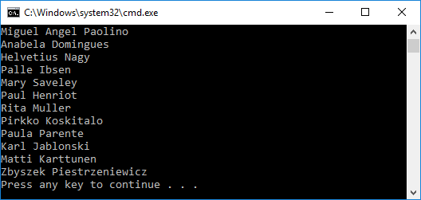

# Getting started with LINQ To DB on .NET Framework with a New Database

In this walkthrough, you will build a console application that performs basic data access against a Microsoft SQL Server database using LINQ To DB. You will use existing database to create your model.

> [!TIP]  
> You can view this article's [sample](https://github.com/linq2db/examples/tree/master/SqlServer/GetStarted) on GitHub.

## Prerequisites

The following prerequisites are needed to complete this walkthrough:

* [Visual Studio 2017](https://www.visualstudio.com/downloads/)

* [Latest version of NuGet Package Manager](https://dist.nuget.org/index.html)

* [Latest version of Windows PowerShell](https://docs.microsoft.com/powershell/scripting/setup/installing-windows-powershell)

* [Northwind Database](https://docs.microsoft.com/en-us/dotnet/framework/data/adonet/sql/linq/downloading-sample-databases) 

> [!TIP]  
> Also there is [Northwind Database script file](https://github.com/linq2db/linq2db/blob/master/Data/northwind.sql.zip) which
can be executed using Microsoft SQL Server Management Studio

## Create a new project

* Open Visual Studio

* File > New > Project...

* From the left menu select Templates > Visual C# > Windows Classic Desktop

* Select the **Console App (.NET Framework)** project template

* Ensure you are targeting **.NET Framework 4.5.1** or later

* Give the project a name and click **OK**

## Install LINQ To DB

To use LINQ To DB, install the package for the database provider(s) you want to target. This walkthrough uses SQL Server. For a list of available providers see [Database Providers](/articles/general/databases.html).

* Tools > NuGet Package Manager > Package Manager Console

* Run `Install-Package linq2db.SqlServer`

## Generate model from database

Now it's time to generate your model from database.

* Project > New Folder...

* Enter *DataModels* as the name and click **OK**

* DataModels > Add Item...  and select **Text Template**

* Enter *Northwind.tt* as the name and click **OK**

* Copy the content from the file Project > *LinqToDB.Templates\CopyMe.SqlServer.tt.txt*

* Modify host, database name and credentials for your SQL Server in `LoadSqlServerMetadata` function call 

* Save *Northwind.tt* - it should invoke model generation

> [!TIP]  
> There are many ways to customize generation process. Follow this [link](/articles/Source/LinqToDB.Templates/README.html) for details.

## Use your model

You can now use your model to perform data access.

* Open *App.config*
* Replace the contents of the file with the following XML (correct connection string based on your server location and credentials)
``` xml
<?xml version="1.0" encoding="utf-8"?>

<configuration>
  <connectionStrings>
    <add name="MyDatabase" providerName="System.Data.SqlClient"
         connectionString="Data Source=.;Database=Northwind;Integrated Security=SSPI;" />
  </connectionStrings>
</configuration>
```

* Open *Program.cs*

* Replace the contents of the file with the following code

<!-- [!code-csharp[Main](samples/core/GetStarted/FullNet/ConsoleApp.NewDb/Program.cs)] -->
``` csharp
using System;
using System.Linq;

namespace GetStarted
{
	class Program
	{
		static void Main(string[] args)
		{
			using (var db = new DataModel.NorthwindDB())
			{
				var q =
					from c in db.Customers
					select c;

				foreach (var c in q)
					Console.WriteLine(c.ContactName);
			}
		}
	}
}
```

* Debug > Start Without Debugging

You will see list of Contact names.


